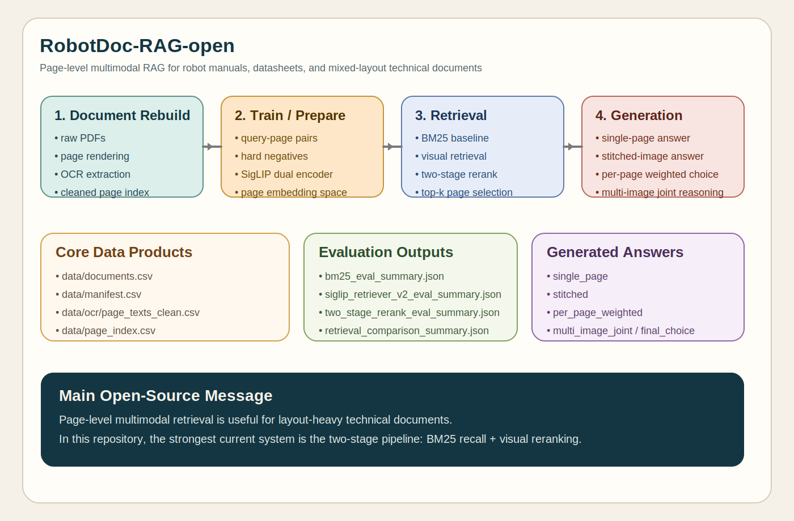

# RobotDoc-RAG-open

[English](README.md) | 简体中文

RobotDoc-RAG-open 是一个面向机器人说明书、datasheet 和其他图文混排技术文档的页级多模态 RAG 项目。

它聚焦一个很实际的问题：纯 OCR 先行的检索方式，往往难以稳定利用页面版式、图示、表格和视觉对应关系。这个仓库把“文档页”当成一等检索单元，对比 OCR 检索、视觉检索和更强的双阶段多模态检索方案。

## 项目包含什么

- 从原始 PDF 重建页级数据
- OCR 抽取与清洗后的页级索引
- BM25 与页图检索基线
- 基于 SigLIP 的页级双塔检索训练
- BM25 召回 + 视觉重排的双阶段检索
- 多页视觉生成与答案选择
- 可复现的实验输出、报告与项目文档

## 当前最佳检索结果

基于 `outputs/reports/retrieval_comparison_summary.json` 中当前 10 条评测 query，效果最好的整体方案是双阶段检索：

| 方法 | top1 exact acc | top5 exact recall | top1 doc acc | top5 doc recall |
|---|---:|---:|---:|---:|
| BM25 | 0.2 | 0.6 | 0.4 | 0.9 |
| SigLIP v1 | 0.3 | 0.5 | 0.5 | 0.7 |
| SigLIP v2 | 0.2 | 0.2 | 0.5 | 0.6 |
| Two-stage | **0.5** | **0.6** | **0.5** | **0.7** |

## 首页流程图 / 架构图



## 代表性双阶段案例

这些案例来自 `outputs/two_stage_rerank_eval_details.csv`。

### `q005` `workspace diagram`

- 标注页：`fr3_product_manual / page 51`
- 双阶段 top-1：精确命中
- 后续多图生成可以描述 workspace 的 side view 和 top view

### `q009` `7 dof dimensions`

- 标注页：`kinova_gen3_user_guide / page 66`
- 双阶段 top-1：精确命中
- 这是一个典型的版式/图示型检索样例

### `q010` `robot components`

- 标注页：`kinova_gen3_user_guide / page 18`
- 双阶段 top-1：精确命中
- 后续生成可较稳定给出 base、actuators、interface module、vision module 等组成部分

## 环境部署

推荐 Python 版本：

- Python `3.10`

推荐安装方式：

```bash
conda create -n robotdoc-rag python=3.10 -y
conda activate robotdoc-rag
pip install -r requirements-open-source.txt
```

说明：

- `torch` 需要与你的 CUDA 版本匹配
- `paddlex` 用于 OCR 重建阶段
- `colpali-engine` 用于视觉检索基线
- `qwen-vl-utils` 用于多模态生成脚本
- 本仓库默认不附带原始 PDF、重建页图和大体积 embedding cache
- 如果你要在自己的文档上重建流程，请把 PDF 放到 `data/raw_pdfs/` 后重新执行重建

## 快速开始

### 1. 查看可用 pipeline

```bash
python run_pipeline.py --list
```

### 2. 从 PDF 重建页级数据

```bash
python run_pipeline.py data_rebuild
```

### 3. 构建优化后的训练对

```bash
python scripts/data_curation/build_retriever_trainset_v4.py
```

### 4. 训练页级检索器

```bash
python scripts/training/train_dual_encoder.py --describe-only
python scripts/training/train_siglip_retriever_v2.py
```

### 5. 评测检索

```bash
python scripts/evaluation/eval_bm25.py
python scripts/evaluation/eval_siglip_retriever_v1.py --force-reencode
python scripts/evaluation/eval_siglip_retriever_v2.py --force-reencode
python scripts/evaluation/eval_two_stage_rerank.py
python scripts/evaluation/compare_retrieval_runs.py
python scripts/evaluation/analyze_retrieval_failures.py
```

### 6. 运行多页视觉生成

```bash
python scripts/generation/minimal_multimodal_generator.py --query-ids q005 q010 --topk-pages 3
```

## 推荐阅读路径

1. `README.md` / `README.zh-CN.md`
2. `docs/project_showcase.md`
3. `outputs/reports/retrieval_comparison_summary.json`
4. `outputs/two_stage_rerank_eval_details.csv`
5. `outputs/generator_cases/multistrategy_generator_results.json`

## 文档导航

- `docs/README.md`
- `docs/pipeline_overview.md`
- `docs/retriever_training.md`
- `docs/evaluation_workflow.md`
- `docs/generation_workflow.md`
- `docs/project_showcase.md`
- `RELEASE_NOTES.md`
- `docs/release_v1.0.0.md`
